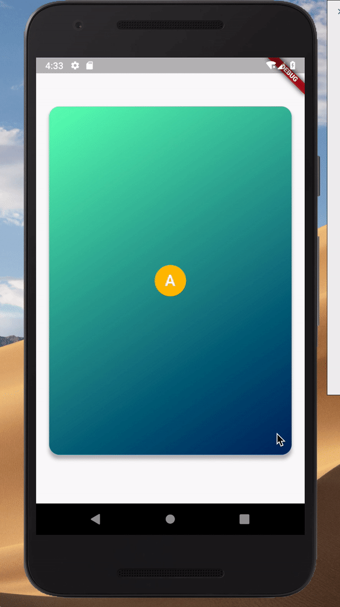

# flutter_flip_view

This is a flutter Widget base on pure Dart code that provides 3D flip card visuals.




# Usage
add package in your pubspec.yaml
```
dependencies:
   flutter_flip_view: ^latest_version
```

This is a simple usage
```
import 'package:flutter_flip_view/flutter_flip_view.dart';

FlipView(
  animationController: _curvedAnimation,
  front: Container(
    width: 300,
    height: 500,
    color: Colors.amber,
    alignment: Alignment.center,
    child: Text('Front'),
  ),
  back: Container(
    width: 300,
    height: 500,
    color: Colors.blueGrey,
    alignment: Alignment.center,
    child: Text('Back'),
  ),
)
```

You can get more usage case in [main.dart](example/lib/main.dart) and [custom_layout_example.dart](example/lib/custom_layout_example.dart)

### Pay attention

**If the widgets you are using within the `flip_view` are wrapped in a `Card` widget or a `Material` widget, you should set the `Card` (or `Material`) property `clipBehavior` to `Clip.hardEdge` or something other than Clip.none.**

## Getting Started

This project is a starting point for a Flutter
[plug-in package](https://flutter.io/developing-packages/),
a specialized package that includes platform-specific implementation code for
Android and/or iOS.

For help getting started with Flutter, view our 
[online documentation](https://flutter.io/docs), which offers tutorials, 
samples, guidance on mobile development, and a full API reference.
